# NexusRetail (RSMS) — Entity Relationship Diagram

Data model for the whole project (Supabase / PostgreSQL). Covers all 4 roles and every feature epic. Render this on GitHub or at [mermaid.live](https://mermaid.live).

```mermaid
erDiagram
    USER ||--o{ ORDER : "sells (associate)"
    USER ||--o{ APPOINTMENT : hosts
    USER ||--o{ AFTER_SALES_TICKET : "handles (specialist)"
    USER ||--o{ SHIFT : works
    USER ||--o{ PERFORMANCE_METRIC : "measured by"
    STORE ||--o| USER : "managed by"
    STORE ||--o{ USER : employs
    STORE ||--o{ PAYMENT_TERMINAL : has
    STORE ||--o{ INVENTORY_ITEM : stocks
    STORE ||--o{ STORE_PRICE : sets
    STORE ||--o{ ORDER : fulfils
    STORE ||--o{ EVENT : hosts
    STORE ||--o{ TRANSFER_REQUEST : requests
    STORE ||--o{ SHIFT : schedules

    SKU ||--o{ PRICE_BAND : "priced per currency"
    SKU ||--o{ STORE_PRICE : "locally priced"
    SKU ||--o{ INVENTORY_ITEM : "tracked as"
    SKU ||--o{ SERIAL_ITEM : "serialized as"
    SKU ||--o{ ORDER_LINE_ITEM : "ordered in"
    SKU ||--o{ TRANSFER_REQUEST : "requested for"
    SKU ||--o{ PURCHASE_ORDER : "reordered for"
    SKU ||--o| EVENT : "launched at"

    CLIENT ||--o{ ORDER : places
    CLIENT ||--o{ APPOINTMENT : books
    CLIENT ||--o{ INVITATION : receives
    CLIENT ||--o{ AFTER_SALES_TICKET : owns

    ORDER ||--|{ ORDER_LINE_ITEM : contains
    ORDER ||--|| PAYMENT : "paid by"
    ORDER ||--o{ WARRANTY : generates
    ORDER_LINE_ITEM }o--o| SERIAL_ITEM : "sold as"

    SERIAL_ITEM ||--o| WARRANTY : "covered by"
    SERIAL_ITEM ||--o{ AFTER_SALES_TICKET : "serviced in"

    EVENT ||--o{ INVITATION : sends

    TRANSFER_REQUEST ||--o| PURCHASE_ORDER : "escalates to"
    TRANSFER_REQUEST ||--o{ NOTIFICATION : triggers

    AFTER_SALES_TICKET ||--o{ CONDITION_PHOTO : has
    AFTER_SALES_TICKET ||--o| ESTIMATE : has
    AFTER_SALES_TICKET ||--o| QA_CHECKLIST : has
    AFTER_SALES_TICKET ||--o{ NOTIFICATION : triggers

    USER {
        uuid id PK
        string name
        string email
        enum role "admin|manager|salesAssociate|afterSales"
        uuid store_id FK "null for admin"
        datetime created_at
    }
    STORE {
        uuid id PK
        string name
        string address
        string locale
        string currency_code
        string timezone
        uuid manager_id FK
        enum status "active|archived"
    }
    PAYMENT_TERMINAL {
        uuid id PK
        uuid store_id FK
        enum type "razorpay|card"
        json config
    }
    SKU {
        uuid id PK
        string name
        string category
        string description
        date launch_date
        uuid created_by FK
    }
    PRICE_BAND {
        uuid id PK
        uuid sku_id FK
        string currency_code
        decimal base_price
        decimal floor_price
    }
    STORE_PRICE {
        uuid id PK
        uuid sku_id FK
        uuid store_id FK
        decimal local_price
    }
    INVENTORY_ITEM {
        uuid id PK
        uuid sku_id FK
        uuid store_id FK
        int on_hand
        int reorder_threshold
    }
    SERIAL_ITEM {
        uuid id PK
        uuid sku_id FK
        uuid store_id FK
        string serial_no
        enum status "in_stock|sold|in_service"
    }
    CLIENT {
        uuid id PK
        string name
        string phone
        json style_preferences
        bool consent_granted
        uuid created_by FK
    }
    APPOINTMENT {
        uuid id PK
        uuid client_id FK
        uuid associate_id FK
        enum type "in_store|video"
        datetime scheduled_at
        enum status
    }
    ORDER {
        uuid id PK
        uuid client_id FK
        uuid store_id FK
        uuid associate_id FK
        enum order_type "store|bopis|ship_from_warehouse"
        enum status
        decimal total
        datetime created_at
    }
    ORDER_LINE_ITEM {
        uuid id PK
        uuid order_id FK
        uuid sku_id FK
        uuid serial_id FK
        int quantity
        decimal applied_price
    }
    PAYMENT {
        uuid id PK
        uuid order_id FK
        enum method "razorpay|card"
        decimal amount
        enum status "authorized|declined|refunded"
        string receipt_url
    }
    TRANSFER_REQUEST {
        uuid id PK
        uuid sku_id FK
        uuid requesting_store_id FK
        uuid source_store_id FK
        int quantity
        enum urgency "low|medium|high"
        enum status "pending|approved|routed|dispatched|delivered|unfulfillable"
    }
    PURCHASE_ORDER {
        uuid id PK
        uuid sku_id FK
        int quantity
        string supplier
        date expected_date
        enum status
    }
    EVENT {
        uuid id PK
        uuid store_id FK
        uuid launch_sku_id FK
        string name
        datetime scheduled_at
        string venue
        string description
    }
    INVITATION {
        uuid id PK
        uuid event_id FK
        uuid client_id FK
        enum rsvp_status "accepted|declined|pending"
    }
    AFTER_SALES_TICKET {
        uuid id PK
        enum type "exchange|return|repair|warranty"
        uuid serial_id FK
        uuid client_id FK
        uuid store_id FK
        uuid specialist_id FK
        enum warranty_status "active|out_of_warranty|voided|unverifiable"
        enum stage "received|in_repair|qa_check|completed"
        datetime created_at
    }
    CONDITION_PHOTO {
        uuid id PK
        uuid ast_id FK
        string url
    }
    ESTIMATE {
        uuid id PK
        uuid ast_id FK
        decimal parts_cost
        decimal labour_cost
        string timeline
        decimal total
        enum approval_status "pending|approved|declined"
    }
    QA_CHECKLIST {
        uuid id PK
        uuid ast_id FK
        bool is_complete
        json items
    }
    WARRANTY {
        uuid id PK
        uuid serial_id FK
        uuid order_id FK
        date start_date
        date end_date
        enum status "active|expired|voided"
    }
    NOTIFICATION {
        uuid id PK
        uuid ast_id FK
        uuid transfer_id FK
        enum channel "push|sms"
        string message
        datetime sent_at
    }
    PERFORMANCE_METRIC {
        uuid id PK
        uuid associate_id FK
        int units_sold
        decimal upsell_rate
        decimal csat
        string period
    }
    SHIFT {
        uuid id PK
        uuid associate_id FK
        uuid store_id FK
        datetime start_at
        datetime end_at
    }
```

## Entity → feature/role map

| Entity | Used by | Stories |
|--------|---------|---------|
| USER, STORE, PAYMENT_TERMINAL | Admin onboarding, RBAC | TEAM5-2,6,7,8,60–63,72,73 |
| SKU, PRICE_BAND, STORE_PRICE | Admin product/pricing, Manager banded pricing | TEAM5-66,67,18,19 |
| INVENTORY_ITEM, SERIAL_ITEM | Inventory, low-stock, QR scan | TEAM5-16,30,31,88 |
| CLIENT, APPOINTMENT | Sales clienteling | TEAM5-20,21,22,23,24 |
| ORDER, ORDER_LINE_ITEM, PAYMENT | Sell / checkout / fulfilment | TEAM5-25,31,33,34,35,87 |
| TRANSFER_REQUEST, PURCHASE_ORDER | Stock requests + transfers | TEAM5-15,68,82,83,84,85,86 |
| EVENT, INVITATION | Manager events | TEAM5-11,12,70,71 |
| AFTER_SALES_TICKET, CONDITION_PHOTO, ESTIMATE, QA_CHECKLIST, WARRANTY | After-sales lifecycle | TEAM5-40–57,75,76,79 |
| NOTIFICATION | Status/milestone alerts | TEAM5-17,86 |
| PERFORMANCE_METRIC, SHIFT | Manager staff oversight | TEAM5-13,14 |

## Key relationships (plain English)
- A **Store** employs many **Users** and is managed by one Manager (a User). Admins have no store.
- A **SKU** is priced per currency (**PriceBand** with base + floor); each **Store** can set a **StorePrice** within that band.
- Stock is tracked per store as **InventoryItem** (counts) and per unit as **SerialItem** (serial numbers).
- A **Client** places **Orders**; each Order has many **OrderLineItems** (each tied to a SKU and optionally a SerialItem) and one **Payment**, and may generate **Warranties**.
- Managers raise **TransferRequests**; if no store can fulfil, it escalates to a **PurchaseOrder**; status changes fire **Notifications**.
- An **AfterSalesTicket** is raised against a **SerialItem** for a **Client**, with **ConditionPhotos**, one **Estimate** (approval-gated), one **QAChecklist**, and milestone **Notifications**.
