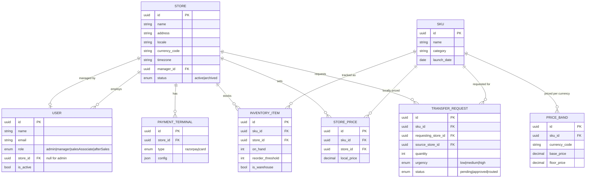

# Sprint 1 — Plan, Steps & ER Diagram

**Goal:** Stand up the foundation (project, Supabase, auth/RBAC) and the Admin "supply side" so stores can be created, stocked, and priced — plus the manager inventory/request basics.

**Capacity:** 21 stories · 65 points · ≈ 187 hrs (Week 1 = 189 hrs).

## Sprint 1 stories
| Group | Stories |
|-------|---------|
| **Foundation / Auth** | TEAM5-60 (admin login + project/auth setup), 61 (manager login), 62 (sales login) |
| **Store onboarding** | TEAM5-2 (create store + Supabase/data-layer setup), 6 (locale/currency/tz), 7 (payment terminals + payment setup), 8 (assign manager), 72 (remove store) |
| **Profiles** | TEAM5-58 (read-only manager profile), 73 (delete manager), 74 (delete staff) |
| **Catalog & pricing** | TEAM5-66 (create SKU), 67 (set floor price), 19 (adjust price within band) |
| **Manager inventory** | TEAM5-16 (low-stock flag), 88 (inventory dashboard) |
| **Stock requests & transfer intake** | TEAM5-15 (raise stock request), 68 (review requests), 82 (verify warehouse stock), 83 (approve transfer) |
| **Admin oversight** | TEAM5-9 (view manager's store) |

---

## Sprint 1 ER diagram (only the entities Sprint 1 touches)

> 8 tables only. No Orders, Clients, AST, Events, Payments-transactions, or Serials yet — those start in Sprint 2/3.

---

## Step-by-step to complete Sprint 1

### Phase 0 — Team & repo setup (Day 1)
1. Merge the scaffold PR, then create `develop` from `main`.
2. Turn on branch protection for `main` + `develop` (require PR + 1 approval + green build).
3. Put real GitHub usernames in `CODEOWNERS`.
4. Create one Supabase project for the team; share keys via a secrets channel (never commit them).

### Phase 1 — Foundation (Platform squad) — do FIRST, unblocks everyone
5. **Supabase setup (TEAM5-2):** create the 8 tables above; add foreign keys; write Row-Level-Security policies per role (admin = global; manager/associate = own `store_id`).
6. **Xcode project:** add `supabase-swift` package; set up MVVM folders, DI container, and the design-system baseline (theme, reusable components).
7. **Local data + sync (TEAM5-2):** SwiftData models mirroring the tables; a simple sync layer to Supabase.
8. **Auth + RBAC (TEAM5-60):** Passkey/Supabase login → `Session` → `RootView` routes by role. Keychain for tokens.
9. **Role logins (TEAM5-61, 62):** reuse the auth framework for Manager and Sales logins.

### Phase 2 — Admin store & catalog (Admin squad)
10. **Create store (TEAM5-2)** with name/address; then **locale/currency/timezone (6)**, **payment terminals (7)**, **assign manager (8)**, **remove store (72)**.
11. **Create SKU (66)** with details + launch date; **set floor price (67)** per currency.
12. **View manager's store (9)**, **read-only manager profile (58)**, **delete manager (73)**, **delete staff (74)**.

### Phase 3 — Manager inventory & pricing (Manager squad)
13. **Low-stock flag (16)** — threshold rule on `INVENTORY_ITEM`.
14. **Inventory dashboard (88)** — show on-hand + low-stock alerts + raise restock request.
15. **Adjust price within band (19)** — write `STORE_PRICE`, validated against `PRICE_BAND.floor_price`.

### Phase 4 — Stock requests & transfer intake (Admin + Manager)
16. **Raise stock request (15)** → creates a `TRANSFER_REQUEST`.
17. **Review requests (68)**, **verify warehouse stock (82)**, **approve transfer (83)** — admin side, status moves pending → approved.

### Phase 5 — Sprint close
18. Write unit tests (auth/RBAC, floor enforcement, low-stock rule).
19. Integration test the happy path: login → create store → create SKU + floor → manager sets local price → raise + approve a stock request.
20. Merge all feature branches into `develop`; demo; tag `v0.1.0`.

## Definition of Done (each story)
- Code + unit test written, builds clean, no warnings.
- RLS verified (a role can't read/write outside its scope).
- PR reviewed by the module's CODEOWNER and merged into `develop`.
- Acceptance criteria in the Jira ticket all met.

## Dependency order (must respect)
`TEAM5-60 (auth+setup)` → `TEAM5-2 (store+data layer)` → `66 (SKU)` → `67 (floor)` → `19 (local price)`; and `15 (raise) → 68 (review) → 82 (verify) → 83 (approve)`; `16 (low-stock) → 88 (dashboard)`. None of these depend on Sprint 2/3.
